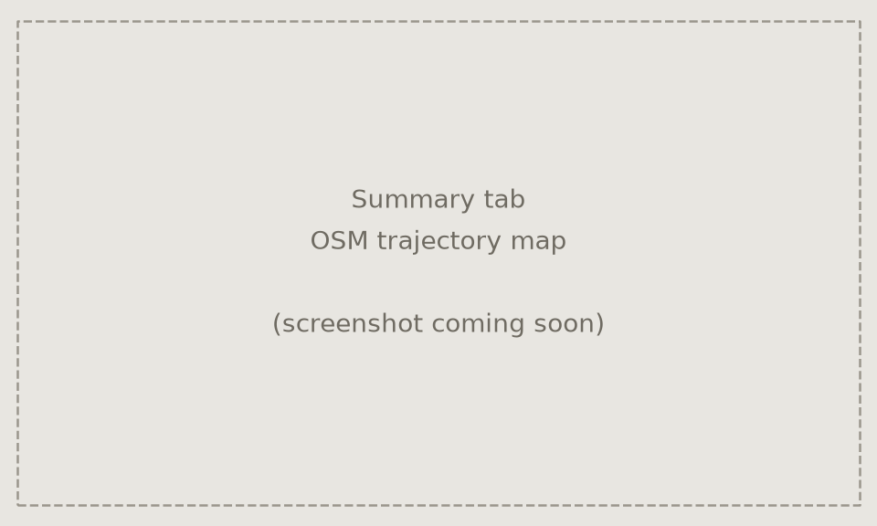
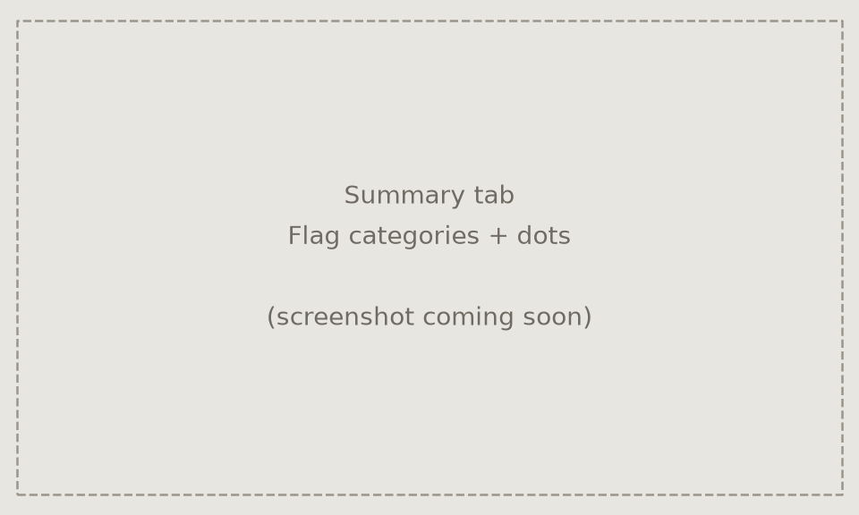

# ArduPilot Flight Log Report

A desktop tool that turns ArduPilot dataflash logs (`.BIN` files, e.g. from the
SD card of a Matek H743 or any other ArduPilot flight controller) or `.tlog`
MAVLink telemetry logs (recorded by a ground station like Mission Planner or
QGroundControl) into a readable, illustrated flight report - with a GUI
preview and a one-click **Save as PDF**.

## Screenshots

> Placeholders below - real screenshots coming soon.

| Trajectory map | Flag categories & dots |
| --- | --- |
|  |  |

The **Summary** tab is the first thing you see for any loaded log: a mode-colored
flight trajectory over a live OpenStreetMap basemap, with dots for any
timestamped automatic-check flags (e.g. accelerometer clipping, an in-flight
RC failsafe) and a toggleable sidebar to show/hide each flag category.

## What it does

- Reads two log formats with [pymavlink](https://github.com/ArduPilot/pymavlink):
  - **`.BIN` dataflash logs** - the full-detail logs ArduPilot itself writes
    to the flight controller's SD card.
  - **`.tlog` MAVLink telemetry logs** - the logs a ground station (Mission
    Planner, QGroundControl, ...) records from the live telemetry link.
    These carry a different, coarser set of MAVLink messages rather than the
    full dataflash message set, so some tabs/fields (e.g. link-quality %,
    main-loop CPU load) may be sparser or unavailable compared to a `.BIN`
    from the same flight - whatever the telemetry stream didn't carry just
    doesn't appear, the same way it would for a `.BIN` with a sensor disabled.
- ArduPilot starts a new log file on every reboot/power-cycle, so a single real
  flight is often split across several files. Point the tool at the folder
  containing them and it merges every log file into one continuous
  timeline, then automatically crops the result down to the single longest
  continuous **armed** period - the actual flight - discarding bench
  arm/disarm blips and ground idle time before/after it.
- Builds a tabbed report: Summary, Flight Modes, Altitude & Airspeed,
  Attitude, PID Tuning, Battery & Power, RC & Servos, RC Link (ELRS),
  Vibration & IMU, System Health, GPS Track, and a full Events/Errors table.
- The **Summary** tab shows a map with the flight trajectory colored per
  flight mode, drawn over live OpenStreetMap tiles fetched for the flight's
  bounding box. Automatic-check flags that have a timestamp (e.g.
  "Accelerometer clipping detected") appear as dots on the map with a
  leader-lined label; a **Flag categories** toggle opens a sidebar to
  show/hide each category by checkbox. Flags with no single timestamp (e.g.
  a battery voltage range for the whole flight) are listed in a plain text
  panel below the map, shown by default. If the aircraft has no GPS at all,
  the map falls back to the local EKF-relative position estimate with no
  basemap; if the OSM tile fetch fails (offline, blocked, timeout) the map
  still draws the trajectory and flags on a plain themed background.
- Runs automatic checks and calls out anything worth a human's attention:
  elevated/critical vibration, accelerometer clipping, battery voltage vs.
  reported-remaining-capacity mismatches, missing GPS/airspeed data, and RC
  failsafes - including whether a failsafe was preceded by an actual
  link-quality drop or looks like a brief packet/timeout glitch instead.
- Exports the whole report (including every events-table page) to a single
  PDF.

- Toolbar controls for Light/Dark mode, a Color scheme accent (Ocean/Ember/
  Amethyst), and a font family/size picker.
- A **Crop to flight only** toggle: on by default (flight-only debugging); untick
  it to keep the full merged log, armed or not, for ground-bench benchmarking.

## Requirements

- Python 3.9+
- [`pymavlink`](https://pypi.org/project/pymavlink/), `numpy`, `matplotlib`, `PySide6`

Install the Python dependencies:

```bash
pip install pymavlink numpy matplotlib PySide6
```

## Usage

```bash
python3 ardupilot_log_report.py
```

No file is read automatically - on launch (or via the **Select Folder...**
button) a folder picker opens. Choose the folder that holds your `.BIN` or
`.tlog` logs (e.g. the SD card's `APM/LOGS` folder, or a local copy of it, or
wherever your ground station saves telemetry logs). Every log file in that
folder is merged and cropped as described above.

- **Select Folder...** - pick a folder; all `.BIN`/`.bin`/`.tlog` files inside
  are merged into one flight.
- **Open File(s)...** - pick one specific log, or multi-select several to
  merge manually.
- The **Log:** dropdown lets you switch between the merged view and any
  individual file in the same folder.
- **Save as PDF** - exports the currently loaded report.

You can also pass a path directly:

```bash
python3 ardupilot_log_report.py /path/to/APM/LOGS       # merges every log in the folder
python3 ardupilot_log_report.py /path/to/00000014.BIN   # opens a single dataflash log
python3 ardupilot_log_report.py /path/to/flight.tlog    # opens a single telemetry log
```

## Notes

- Nothing is scanned or read from your filesystem until you explicitly select
  a folder or file - the tool does not look for SD cards or logs on its own.
- Generated PDF reports contain your flight telemetry and are not written
  anywhere by default beyond the location you choose in the save dialog.
- The Summary tab's map fetches basemap tiles from `tile.openstreetmap.org`
  over the network whenever a log has GPS data - this is the only network
  access the tool makes. It's best-effort: a fetch failure just falls back to
  a plain themed background, and tiles are cached in-process so switching
  Light/Dark/font/accent doesn't re-fetch them. No new pip dependency was
  added for this - tiles are fetched with the standard library and decoded
  with matplotlib's own PNG reader.
